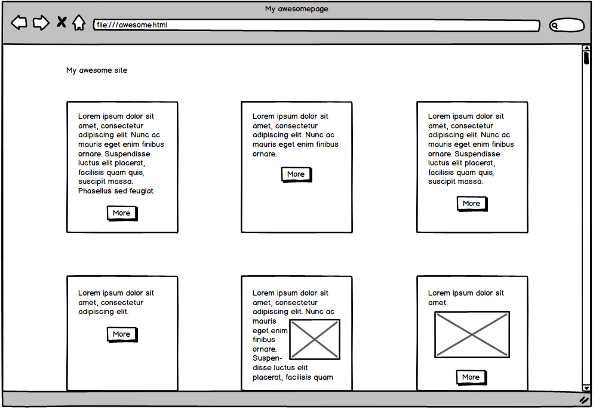
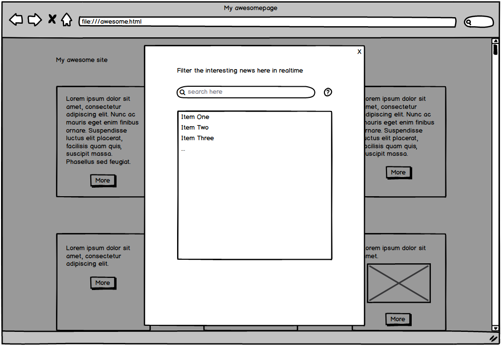

# Einstellungstest Frontend Entwickler - TechDivision GmbH

* Dauer: 2,5 Stunden
* Sprachen: HTML, CSS (SASS/LESS), JS

Die von dir erstellen oder angepassten Dateien bearbeitest und speicherst du direkt in dem von dir geklonten Git Fork des Repositories mit unserem Einstellungstest. Nach Fertigstellung committest du das gesamte Repository einschließlich deiner Dateien und pusht deine Änderungen zurück in deinen Fork. Sobald du fertig bist, gibst du uns Bescheid, so dass wir uns deine Lösung ansehen und bewerten können.

In unsere Bewertung fließen folgende Faktoren mit ein:

1. Die Zeit, die du für die Fertigstellung benötigst (maximal 2,5 Stunden)
2. Qualität deiner Implementierung
3. Nutzbarkeit deiner Lösung
4. Korrekte Darstellung, auch auf unterschiedlichen Medien und Bildschirmgrößen
5. Nutzung moderner Lösungsansätze
6. Menge an umgesetzen Aufgaben

## Vorbereitung

Der Einstellungstest geht davon aus, dass du bereits über grundlegende Kenntnisse im Einsatz von npm oder yarn verfügst, diese sind allerdings nicht zwangsläufig notwendig. Der Einstellungstest besteht aus den folgenden Dateien:

* dieser `README.md` Datei mit Informationen über den Ablauf
* einer `package.json` als Rahmen falls du Abhängikeiten nachladen möchtest
* einen minimalen Projektaufbau im `src` Ordner inklusive zwei Bilder die verwendet werden können
* die Wireframes die in dieser Readme eingebunden sind 

Nachdem du dir den Einstellungstest erfolgreich über git geklont hast, kannst du dir Gedanken zu eventuell nötigen Abhängigkeiten machen.
Falls du, was optional aber bevorzugt ist, einen CSS Preprocessor nutzt solltest du ihn dir jetzt einrichten.

Wechsle in das Projektverzeichnis und beginne mit der Bearbeitung.

	:::sh
	console:~ cd recruiting-test-fe

## Aufgabenstellung

Im Folgenden siehst du die Mockup Wireframes einer Web-Oberfläche.
Deine Aufgabe ist es, diese in mehreren Schritten nachzubauen. Dabei gibt es bewusst mehrere kleine Zusatzaufgaben,
deren Umsetzung in die Bewertung mit einfließen.

In welcher Reihenfolge du die Aufgaben bearbeitest bleibt dir überlassen.

In einem fiktiven Kundenprojekt benötigen wir eine Übersicht über einzelne CMS Inhalte, z.B. eines Koch-Blogs.

Die Übersicht soll ähnlich zu folgendem Wireframe aussehen.

Erstelle eine solche Übersicht innerhalb einer HTML Datei.
Achte vor allem auf eine einheitliche Darstellung der einzelnen Elemente und die Möglichkeit die Seite auf verschiedenen Geräten anzuzeigen.

### Responsive
Achte bei der Darstellung darauf, dass Inhalte responsive sind.

### Breakpoint
Um die Seite auch für Mobile Nutzer ansehnlich zu gestalten, sollst du einen Breakpoint bei 480 Pixeln einbauen. Unterhalb dieser Grenze wird aus
den Elementen eine ein-spaltige Darstellung, die alle Elemente untereinander anzeigt.

### "More" Overlay

Wie aus dem ersten Wireframe ersichtlich, haben die einzelnen Beitrags-Previews einen *More* Button.
Ein Klick auf diesen Button soll ein Overlay öffnen, ähnlich zu dem in folgendem Wireframe gezeigten:

Als Bonus kannst du auch die üblichen Funktionen eines Overlays, z.B. das Schließen beim Klick auf das *X* oder beim Drücken der Escape Taste berücksichtigen.

### Spezielle Icons

Das CI/CD sieht einige spezielle Icons vor. Nutze einen externen Font (z.B. [Font Awesome](https://fontawesome.com/)) und nutze es für das *Hilfe* Icon auf dem Overlay.

### Liste Filtern

Um beim Beispiel unseres Koch-Blogs zu bleiben, beinhaltet das geöffnete Overlay eine Sammlung von Rezeptvorschlägen.
Beispielhaft vertreten durch diese Lorem Ipsum Liste:

- Lorem ipsum dolor sit amet
- Dolor parturient dapibus
- Risus augue
- Enim facilisis 
- Inceptos etiam pulvinar 
- Blandit mattis
- Sed dolor bibendum 
- Velit vestibulum
- Egestas fringilla
- Suspendisse at dictum

Diese sollen mit Hilfe von Javascript in Echtzeit filterbar sein.
So soll z.B. bei der Eingabe des Buchstaben *l* in das Suchfeld die Liste auf alle Einträge die auch ein *l* beinhalten reduzuiert werden.
Bei Eingabe eines weiteren Buchstabens, z.B. *o* auf alle Einträge die die Buchstabenkombination *lo* enthalten und so weiter.

Erreicht werden kann dieses Verhalten sowohl durch die Nutzung einer fertigen Javascript Bibliothek, als auch durch selbst entwickelten reinen JS Code.
Selbst entwickelter JS Code wird hier als Bonus betrachtet.